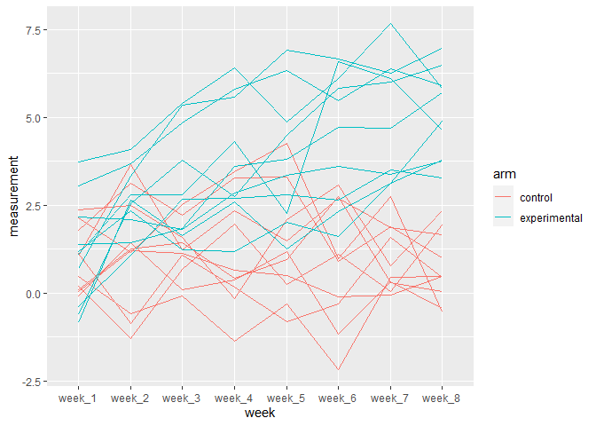

P8105 Homework 5
================
Jesse R. Ames
11/20/2021

*With assistance from Jeff Goldsmith*

## Problem 1

``` r
library(tidyverse)
```

    ## -- Attaching packages --------------------------------------- tidyverse 1.3.1 --

    ## v ggplot2 3.3.5     v purrr   0.3.4
    ## v tibble  3.1.4     v dplyr   1.0.7
    ## v tidyr   1.1.3     v stringr 1.4.0
    ## v readr   2.0.1     v forcats 0.5.1

    ## -- Conflicts ------------------------------------------ tidyverse_conflicts() --
    ## x dplyr::filter() masks stats::filter()
    ## x dplyr::lag()    masks stats::lag()

``` r
murder <- read_csv("homicide-data.csv", na = c("", "Unknown"))
```

    ## Rows: 52179 Columns: 12

    ## -- Column specification --------------------------------------------------------
    ## Delimiter: ","
    ## chr (8): uid, victim_last, victim_first, victim_race, victim_sex, city, stat...
    ## dbl (4): reported_date, victim_age, lat, lon

    ## 
    ## i Use `spec()` to retrieve the full column specification for this data.
    ## i Specify the column types or set `show_col_types = FALSE` to quiet this message.

``` r
names(murder)
```

    ##  [1] "uid"           "reported_date" "victim_last"   "victim_first" 
    ##  [5] "victim_race"   "victim_age"    "victim_sex"    "city"         
    ##  [9] "state"         "lat"           "lon"           "disposition"

This dataset contains 52179 rows with the following variables:

-   `uid` - A unique identifier code
-   `reported_date` - Reported date of the homicide
-   `victim_last` - Victim’s last name
-   `victim_first` - Victim’s first name
-   `victim_race` - Victim’s race (White, Black, Hispanic, Asian, or
    Other)
-   `victim_age` - Victim’s age (median 28)
-   `victim_sex` - Victim’s sex (Male, Female)
-   `city` and `state`
-   `lat` latitude and `lon` longitude
-   `disposition` - Status of the case (Closed by arrest, open/no
    arrest, or closed without arrest)

``` r
murder <- murder %>%
  #Create city_state variable
  mutate(city_state = str_c(city, state)) %>%
  relocate(city_state) %>%
  #Is the case resolved?
  mutate(resolution = case_when(
    disposition == "Closed by arrest" ~ "solved",
    disposition == "Closed without arrest" ~ "unsolved",
    disposition == "Open/No arrest" ~ "unsolved"
  )) %>%
  filter(city_state != "TulsaAL")
  
#What is the unresolved rate in Baltimore, MD?
baltimore <- murder %>%
  filter(city_state == "BaltimoreMD")
  
balt_sum <- baltimore %>%
  summarize(
    unsolved = sum(resolution == "unsolved"),
    n = n()
  )

balt_prop <- prop.test(
  x = balt_sum %>% pull(unsolved),
  n = balt_sum %>% pull(n)
)

balt_prop %>%
  broom::tidy() %>%
  pull(estimate)
```

    ##         p 
    ## 0.6455607

``` r
#Iterate over all cities
##Create test function
prop_test_function <- function(city_df) {
  city_summary <- city_df %>%
    summarize(
      unsolved = sum(resolution == "unsolved"),
      n = n()
    )
  
  city_test <- prop.test(
    x = city_summary %>% pull(unsolved),
    n = city_summary %>% pull(n)
  )
  
  return(city_test)
}

##Nest and iterate
results <- murder %>%
  nest(data = uid:resolution) %>%
  mutate(
    test_results = map(data, prop_test_function),
    tidy_results = map(test_results, broom::tidy)
  ) %>%
  select(city_state, tidy_results) %>%
  unnest(tidy_results) %>%
  select(city_state, estimate, starts_with("conf"))

head(results)
```

    ## # A tibble: 6 x 4
    ##   city_state    estimate conf.low conf.high
    ##   <chr>            <dbl>    <dbl>     <dbl>
    ## 1 AlbuquerqueNM    0.386    0.337     0.438
    ## 2 AtlantaGA        0.383    0.353     0.415
    ## 3 BaltimoreMD      0.646    0.628     0.663
    ## 4 Baton RougeLA    0.462    0.414     0.511
    ## 5 BirminghamAL     0.434    0.399     0.469
    ## 6 BostonMA         0.505    0.465     0.545

``` r
#Plot estimates, CIs
results %>%
  mutate(city_state = fct_reorder(city_state, estimate)) %>%
  ggplot(aes(x = city_state, y = estimate)) +
  geom_point() +
  geom_errorbar(aes(ymin = conf.low, ymax = conf.high)) +
  theme(axis.text.x = element_text(angle = 90, vjust = 0.5, hjust = 1))
```

<!-- -->

## Problem 2

``` r
con_exp <- tibble(filepath = paste0("data/", list.files("data")))
con_exp <- con_exp %>%
  #Get arm, subject_id from file names
  mutate(arm = substr(filepath,6,8),
         subject_id = substr(filepath,6,11)) %>%
  
  #Read in data
  mutate(df = map(filepath, read_csv, show_col_types = FALSE)) %>%
  
  #Tidy
  unnest(cols = c(df)) %>%
  pivot_longer(cols = week_1:week_8, names_to = "week", values_to = "measurement") %>%
  mutate(arm = fct_recode(arm, control = "con", experimental = "exp"))
  
#Plot
con_exp %>%
  ggplot(aes(x = week, y = measurement, color = arm, group = subject_id)) +
  geom_line()
```

<!-- -->

As the experiment progressed, the experimental group’s measurements
appear to increase overall relative to the control, though we might want
to model this more formally. The appropriate regression model for the
marginal trend would be a general linear model (generalized least
squares); the appropriate model for the conditional trend would be a
linear mixed-effects model.

## Problem 3

``` r
#library(tidyverse)

set.seed(10)

iris_with_missing = iris %>% 
  map_df(~replace(.x, sample(1:150, 20), NA)) %>%
  mutate(Species = as.character(Species))

#Interpolation function
interpolate <- function(x){
  if (is.numeric(x)) {
    #mean interpolation
    mean_nm <- mean(x, na.rm = TRUE)
    y <- x
    y[which(is.na(y))] <- mean_nm
    return(y)
  }
  else if (is.character(x)) {
    #Fill in with "virginica"
    y <- x
    y[which(is.na(y))] <- "virginica"
    return(y)
  }
}

#map 
iris_with_missing %>%
  map(interpolate)
```

    ## $Sepal.Length
    ##   [1] 5.100000 4.900000 4.700000 4.600000 5.000000 5.400000 5.819231 5.000000
    ##   [9] 4.400000 4.900000 5.400000 4.800000 5.819231 4.300000 5.819231 5.700000
    ##  [17] 5.400000 5.100000 5.700000 5.100000 5.400000 5.100000 4.600000 5.819231
    ##  [25] 4.800000 5.000000 5.000000 5.200000 5.819231 4.700000 4.800000 5.400000
    ##  [33] 5.200000 5.500000 4.900000 5.000000 5.500000 4.900000 4.400000 5.100000
    ##  [41] 5.000000 4.500000 4.400000 5.000000 5.100000 4.800000 5.100000 4.600000
    ##  [49] 5.300000 5.000000 7.000000 6.400000 6.900000 5.500000 6.500000 5.700000
    ##  [57] 6.300000 4.900000 6.600000 5.200000 5.000000 5.900000 6.000000 6.100000
    ##  [65] 5.600000 6.700000 5.600000 5.800000 6.200000 5.600000 5.900000 5.819231
    ##  [73] 6.300000 5.819231 6.400000 6.600000 6.800000 6.700000 6.000000 5.700000
    ##  [81] 5.500000 5.819231 5.800000 6.000000 5.400000 5.819231 6.700000 5.819231
    ##  [89] 5.600000 5.500000 5.500000 5.819231 5.800000 5.000000 5.819231 5.700000
    ##  [97] 5.700000 6.200000 5.100000 5.700000 6.300000 5.800000 7.100000 6.300000
    ## [105] 6.500000 7.600000 4.900000 7.300000 6.700000 5.819231 6.500000 5.819231
    ## [113] 6.800000 5.700000 5.800000 6.400000 6.500000 7.700000 7.700000 6.000000
    ## [121] 5.819231 5.600000 7.700000 6.300000 6.700000 7.200000 6.200000 6.100000
    ## [129] 6.400000 7.200000 7.400000 7.900000 6.400000 5.819231 6.100000 5.819231
    ## [137] 5.819231 6.400000 6.000000 6.900000 6.700000 6.900000 5.819231 6.800000
    ## [145] 6.700000 6.700000 6.300000 6.500000 5.819231 5.900000
    ## 
    ## $Sepal.Width
    ##   [1] 3.500000 3.000000 3.200000 3.100000 3.600000 3.900000 3.400000 3.400000
    ##   [9] 2.900000 3.100000 3.075385 3.400000 3.075385 3.000000 4.000000 4.400000
    ##  [17] 3.900000 3.500000 3.800000 3.800000 3.400000 3.700000 3.600000 3.300000
    ##  [25] 3.400000 3.000000 3.400000 3.500000 3.400000 3.200000 3.100000 3.075385
    ##  [33] 3.075385 4.200000 3.100000 3.200000 3.500000 3.600000 3.000000 3.400000
    ##  [41] 3.500000 3.075385 3.200000 3.500000 3.800000 3.000000 3.800000 3.200000
    ##  [49] 3.700000 3.075385 3.075385 3.200000 3.100000 2.300000 2.800000 2.800000
    ##  [57] 3.300000 2.400000 2.900000 2.700000 2.000000 3.000000 2.200000 2.900000
    ##  [65] 2.900000 3.100000 3.000000 3.075385 2.200000 2.500000 3.200000 2.800000
    ##  [73] 2.500000 2.800000 2.900000 3.000000 2.800000 3.075385 3.075385 2.600000
    ##  [81] 2.400000 2.400000 2.700000 2.700000 3.000000 3.400000 3.100000 3.075385
    ##  [89] 3.000000 2.500000 3.075385 3.075385 3.075385 2.300000 2.700000 3.000000
    ##  [97] 2.900000 2.900000 2.500000 2.800000 3.075385 2.700000 3.000000 2.900000
    ## [105] 3.075385 3.000000 2.500000 2.900000 3.075385 3.600000 3.200000 2.700000
    ## [113] 3.000000 3.075385 2.800000 3.200000 3.000000 3.800000 2.600000 2.200000
    ## [121] 3.200000 3.075385 2.800000 2.700000 3.300000 3.200000 2.800000 3.000000
    ## [129] 2.800000 3.000000 2.800000 3.800000 2.800000 2.800000 3.075385 3.000000
    ## [137] 3.400000 3.100000 3.000000 3.100000 3.100000 3.100000 2.700000 3.200000
    ## [145] 3.300000 3.000000 2.500000 3.000000 3.400000 3.000000
    ## 
    ## $Petal.Length
    ##   [1] 1.400000 1.400000 1.300000 1.500000 1.400000 1.700000 1.400000 1.500000
    ##   [9] 1.400000 3.765385 1.500000 1.600000 1.400000 3.765385 3.765385 1.500000
    ##  [17] 1.300000 1.400000 1.700000 1.500000 1.700000 1.500000 1.000000 3.765385
    ##  [25] 1.900000 3.765385 1.600000 1.500000 1.400000 1.600000 3.765385 1.500000
    ##  [33] 1.500000 1.400000 3.765385 1.200000 1.300000 1.400000 1.300000 1.500000
    ##  [41] 1.300000 1.300000 1.300000 1.600000 1.900000 1.400000 1.600000 3.765385
    ##  [49] 1.500000 1.400000 4.700000 4.500000 4.900000 4.000000 4.600000 4.500000
    ##  [57] 4.700000 3.765385 4.600000 3.900000 3.765385 4.200000 4.000000 4.700000
    ##  [65] 3.600000 4.400000 4.500000 4.100000 4.500000 3.900000 4.800000 4.000000
    ##  [73] 4.900000 3.765385 4.300000 4.400000 4.800000 5.000000 4.500000 3.500000
    ##  [81] 3.800000 3.700000 3.900000 5.100000 4.500000 4.500000 4.700000 4.400000
    ##  [89] 3.765385 4.000000 4.400000 4.600000 4.000000 3.300000 4.200000 4.200000
    ##  [97] 4.200000 4.300000 3.000000 4.100000 3.765385 5.100000 5.900000 5.600000
    ## [105] 5.800000 6.600000 4.500000 6.300000 3.765385 3.765385 5.100000 5.300000
    ## [113] 5.500000 5.000000 5.100000 5.300000 3.765385 6.700000 6.900000 5.000000
    ## [121] 5.700000 4.900000 6.700000 4.900000 5.700000 6.000000 4.800000 4.900000
    ## [129] 5.600000 5.800000 6.100000 3.765385 3.765385 5.100000 5.600000 6.100000
    ## [137] 5.600000 5.500000 4.800000 5.400000 5.600000 5.100000 5.100000 3.765385
    ## [145] 3.765385 5.200000 5.000000 5.200000 5.400000 5.100000
    ## 
    ## $Petal.Width
    ##   [1] 0.200000 0.200000 0.200000 1.192308 0.200000 0.400000 0.300000 0.200000
    ##   [9] 0.200000 0.100000 0.200000 0.200000 0.100000 0.100000 0.200000 0.400000
    ##  [17] 0.400000 1.192308 0.300000 1.192308 0.200000 0.400000 0.200000 0.500000
    ##  [25] 0.200000 0.200000 0.400000 0.200000 0.200000 0.200000 0.200000 0.400000
    ##  [33] 0.100000 0.200000 0.200000 0.200000 0.200000 0.100000 1.192308 0.200000
    ##  [41] 0.300000 1.192308 0.200000 0.600000 0.400000 0.300000 0.200000 0.200000
    ##  [49] 0.200000 0.200000 1.400000 1.500000 1.500000 1.300000 1.500000 1.300000
    ##  [57] 1.600000 1.000000 1.300000 1.400000 1.000000 1.500000 1.192308 1.400000
    ##  [65] 1.300000 1.400000 1.500000 1.000000 1.500000 1.100000 1.800000 1.300000
    ##  [73] 1.500000 1.200000 1.300000 1.400000 1.400000 1.192308 1.192308 1.000000
    ##  [81] 1.100000 1.000000 1.200000 1.600000 1.500000 1.600000 1.192308 1.300000
    ##  [89] 1.192308 1.192308 1.200000 1.192308 1.192308 1.192308 1.300000 1.200000
    ##  [97] 1.300000 1.300000 1.192308 1.300000 2.500000 1.900000 2.100000 1.800000
    ## [105] 2.200000 2.100000 1.700000 1.800000 1.800000 2.500000 2.000000 1.900000
    ## [113] 2.100000 2.000000 2.400000 2.300000 1.800000 1.192308 2.300000 1.500000
    ## [121] 1.192308 2.000000 2.000000 1.800000 2.100000 1.800000 1.800000 1.800000
    ## [129] 2.100000 1.600000 1.192308 2.000000 2.200000 1.500000 1.400000 2.300000
    ## [137] 1.192308 1.192308 1.800000 2.100000 2.400000 2.300000 1.900000 2.300000
    ## [145] 2.500000 2.300000 1.900000 2.000000 2.300000 1.800000
    ## 
    ## $Species
    ##   [1] "setosa"     "setosa"     "setosa"     "setosa"     "setosa"    
    ##   [6] "setosa"     "setosa"     "setosa"     "setosa"     "setosa"    
    ##  [11] "setosa"     "setosa"     "setosa"     "setosa"     "setosa"    
    ##  [16] "setosa"     "setosa"     "setosa"     "setosa"     "setosa"    
    ##  [21] "setosa"     "virginica"  "setosa"     "setosa"     "virginica" 
    ##  [26] "setosa"     "virginica"  "setosa"     "setosa"     "setosa"    
    ##  [31] "setosa"     "setosa"     "setosa"     "setosa"     "setosa"    
    ##  [36] "setosa"     "setosa"     "setosa"     "setosa"     "setosa"    
    ##  [41] "setosa"     "virginica"  "setosa"     "setosa"     "setosa"    
    ##  [46] "virginica"  "setosa"     "setosa"     "setosa"     "setosa"    
    ##  [51] "virginica"  "versicolor" "versicolor" "versicolor" "versicolor"
    ##  [56] "versicolor" "virginica"  "versicolor" "virginica"  "versicolor"
    ##  [61] "versicolor" "versicolor" "versicolor" "versicolor" "versicolor"
    ##  [66] "versicolor" "versicolor" "versicolor" "versicolor" "versicolor"
    ##  [71] "versicolor" "virginica"  "versicolor" "versicolor" "versicolor"
    ##  [76] "versicolor" "versicolor" "versicolor" "versicolor" "virginica" 
    ##  [81] "versicolor" "versicolor" "versicolor" "versicolor" "versicolor"
    ##  [86] "versicolor" "versicolor" "versicolor" "versicolor" "versicolor"
    ##  [91] "versicolor" "versicolor" "versicolor" "virginica"  "versicolor"
    ##  [96] "versicolor" "versicolor" "versicolor" "versicolor" "virginica" 
    ## [101] "virginica"  "virginica"  "virginica"  "virginica"  "virginica" 
    ## [106] "virginica"  "virginica"  "virginica"  "virginica"  "virginica" 
    ## [111] "virginica"  "virginica"  "virginica"  "virginica"  "virginica" 
    ## [116] "virginica"  "virginica"  "virginica"  "virginica"  "virginica" 
    ## [121] "virginica"  "virginica"  "virginica"  "virginica"  "virginica" 
    ## [126] "virginica"  "virginica"  "virginica"  "virginica"  "virginica" 
    ## [131] "virginica"  "virginica"  "virginica"  "virginica"  "virginica" 
    ## [136] "virginica"  "virginica"  "virginica"  "virginica"  "virginica" 
    ## [141] "virginica"  "virginica"  "virginica"  "virginica"  "virginica" 
    ## [146] "virginica"  "virginica"  "virginica"  "virginica"  "virginica"
